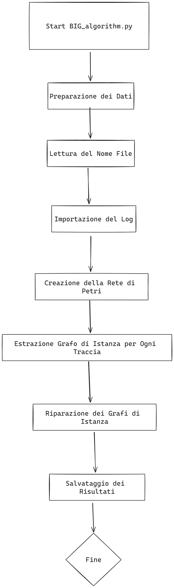
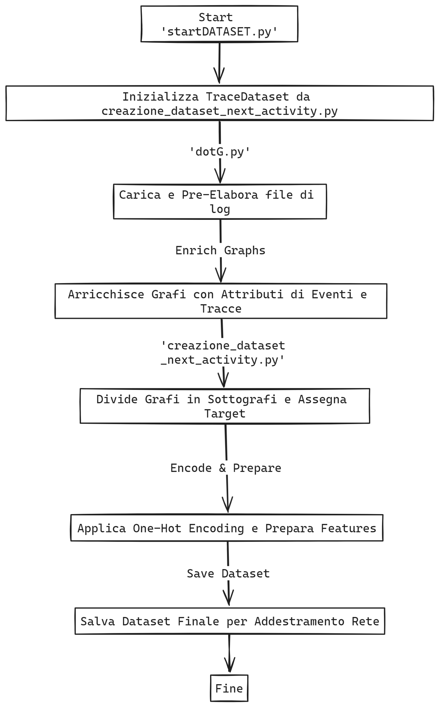
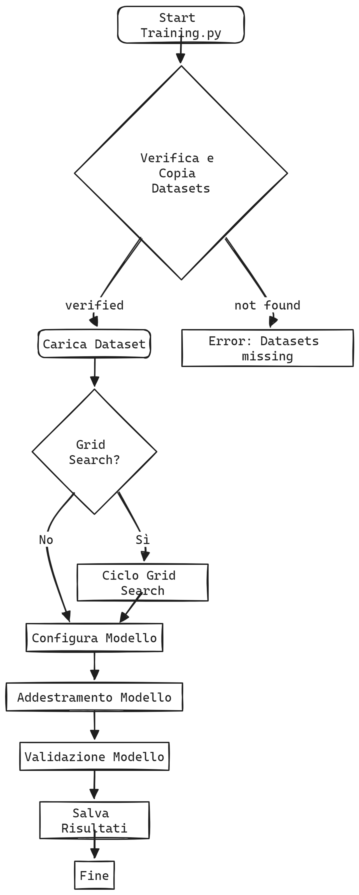

# Next Activity Prediction
Materials for Next Activity Prediction through Graph Neural Networks

## Requirements
- Python 3.10 (mandatory)
- Libraries, included in requirements.txt

For install, move to ``nextActivityPrediction`` directory, then run:  
``pip install -r requirements.txt``

## How it works (brief explaination to improve)
Please note that code names must be updated, this section is exclusively to illustrate the methodology of our approach. 
- BIG.py: 
 
- DATASET.py: 
 
- TRAINING.py: 
 

## How to run
- To create instance graphs, run: 
``python BIG.py``

- To create state graphs for dataset enrichment with subgraphs, run: 
``python STATE.py``

- To preprocess instance graphs for DGCNN, run: 
``python DATASET.py``

- To train the DGCNN, run: 
``python TRAINING.py``

## Results (necessary?)
